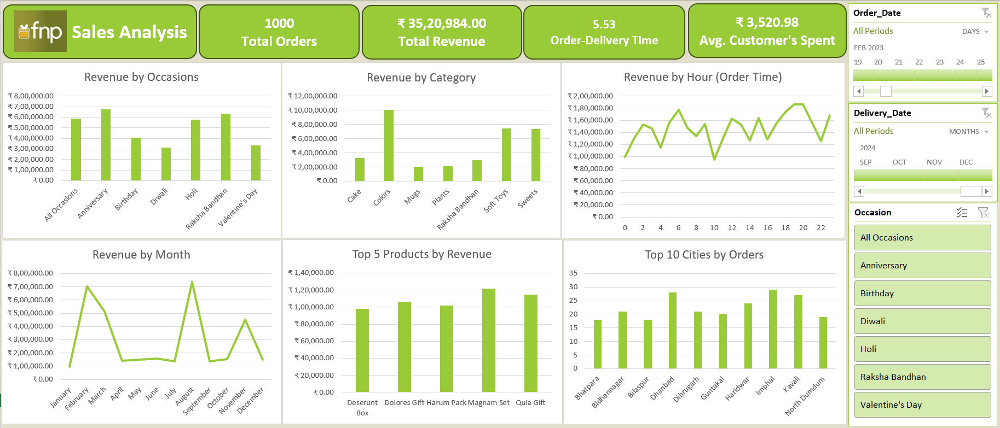

# FNP Sales Analysis — Excel Dashboard

An interactive Excel dashboard project analyzing sales performance for **Ferns N Petals (FNP)**.  
This project focuses on uncovering revenue trends, customer behavior, product performance, and delivery efficiency across multiple business dimensions.

The analysis is designed to support data-driven decision-making using Excel-based analytics and visualization techniques.

---

## Dashboard Preview

---

## 📂 Project Structure & Files

------------------------------------------------------------------------

-   `workbook/FNP_Sales_Dashboard.xlsx`\
-   `data/raw/` --- Raw sample dataset\
-   `data/processed/` --- Cleaned dataset\
-   `docs/executive_summary.md`\
-   `docs/methodology.md`\
-   `exports/` --- Dashboard images & PDF\
-   `presentation/` --- (optional) PPT summary

------------------------------------------------------------------------

## Key Insights

-   Total Revenue: ₹35,20,984\
-   Total Orders: 1000\
-   Avg. Customer Spend: ₹3,520.98\
-   Avg. Delivery Time: 5.53 days\
-   Top Occasions: Anniversary, Rakhi, Holi\
-   Best Categories: Colors, Soft Toys, Sweets\
-   Peak Ordering Times: 4--8 AM & 6--8 PM

------------------------------------------------------------------------

## Tools Used

Excel, Power Query, Pivot Tables, Slicers, Charts

------------------------------------------------------------------------

## How to Open

1.  Download the Excel file\
2.  Open in Excel\
3.  Enable content\
4.  Refresh All
