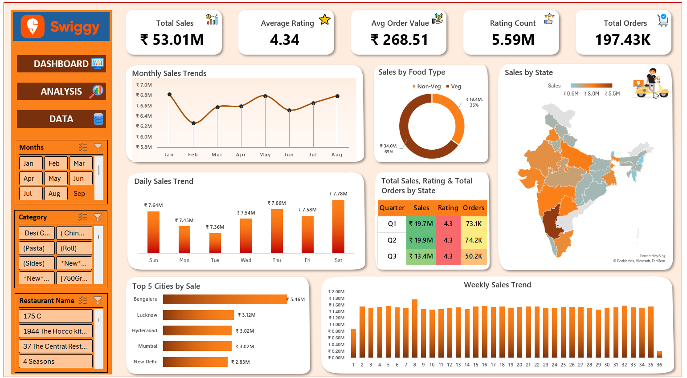

# Swiggy Sales & Customer Behavior Analysis — Excel Dashboard

An interactive **Excel dashboard project** analyzing sales performance and customer behavior for **Swiggy**, a leading online food delivery platform in India.

This project focuses on understanding **revenue trends, order patterns, customer satisfaction, food preferences (Veg vs Non-Veg), and geographic performance** using Excel-based analytics and visualization techniques.

The analysis is designed to support **data-driven business and operational decision-making**.

---

## Dashboard Preview

---

## Project Structure

Project_02_Swiggy_Sales_Analysis/ 
`│` 
`├── data/` 
`│   └── raw/Swiggy Raw Data Excel.xlsx  # Raw Swiggy order-level Excel dataset` 
`│` 
`├── docs/` 
`│   ├── executive_summary.md            # Business summary & insights` 
`│   ├── swiggy_problem_statements.pptx  # Problem Statements/Findings` 
`│   └── methodology.md                  # Data preparation & analysis approach` 
`│` 
`├── exports/` 
`│   └── dashboard_screenshot.png        # Dashboard visuals` 
`│` 
`├── assets/` 
`│   └── images/                         # Logos & dashboard icons` 
`│` 
`├── workbook/` 
`│   └── Swiggy_Analysis_Dashboard.xlsx  # Interactive Excel dashboard/Analysis` 
`│` 
`└── README.md                           # Project documentation` 

---

## Business Objectives
- Analyze overall **sales performance and order volume**
- Measure **customer satisfaction** using ratings data
- Track **Average Order Value (AOV)**
- Compare **Veg vs Non-Veg food revenue contribution**
- Identify **top-performing cities and states**
- Analyze **daily, weekly, monthly, and quarterly sales trends**
- Deliver an **interactive Excel dashboard** for business stakeholders

---

## Key KPIs Tracked
- **Total Sales (₹)** – Overall revenue generated
- **Total Orders** – Number of orders placed
- **Average Order Value (₹)** – Revenue per order
- **Average Rating** – Customer satisfaction score
- **Ratings Count** – Total customer reviews

---

## Key Analysis Areas
- **Time-Based Trends:** Daily, weekly, monthly, and quarterly sales analysis
- **Food Preference Analysis:** Veg vs Non-Veg revenue contribution
- **Geographic Analysis:** State-wise sales distribution and top cities
- **Customer Behavior:** Ratings and order patterns
- **Performance Monitoring:** KPI-driven insights for decision-making

---

## Tools & Techniques Used
- Microsoft Excel (Advanced)
- Power Query (ETL & Data Transformation)
- Pivot Tables & Pivot Charts
- KPI Design & Performance Reporting
- Map Charts for geographic analysis
- Slicers & Filters for interactivity
- Dashboard layout & visualization best practices

---

## How to Use the Dashboard
1. Download the Excel file from the `workbook/` folder
2. Open `Swiggy_Analysis_Dashboard.xlsx` in Microsoft Excel
3. Enable content/macros (if prompted)
4. Go to **Data → Refresh All**
5. Use slicers and filters to explore insights interactively

---

## Notes
- This project uses **sample/anonymized data** for learning and portfolio purposes
- The dashboard is optimized for **desktop Excel viewing**

---

## Outcome
This project demonstrates my ability to:
- Perform **end-to-end Excel-based data analysis**
- Apply **feature engineering and KPI tracking**
- Build **business-ready interactive dashboards**
- Analyze customer behavior and food delivery trends
- Communicate insights clearly to stakeholders
